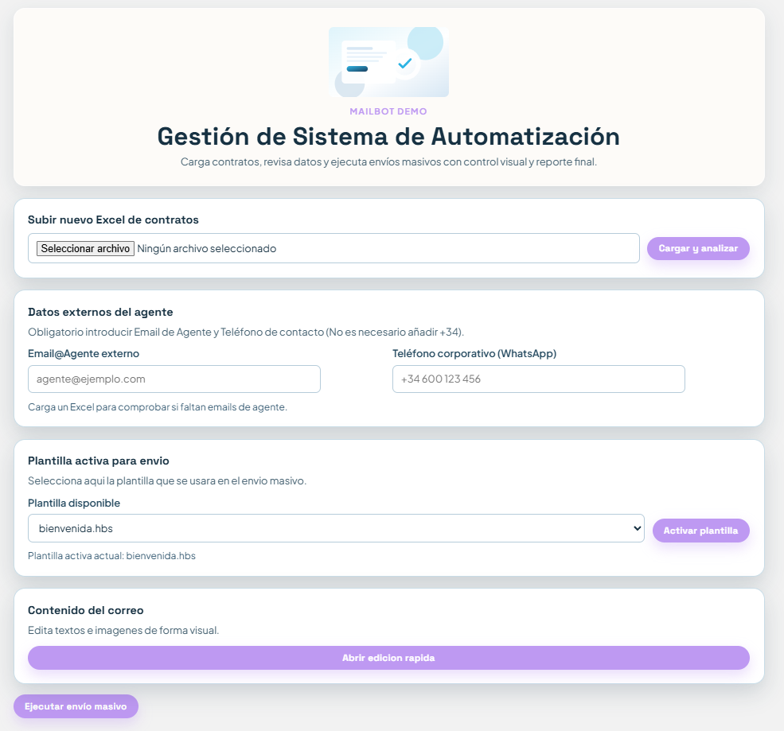
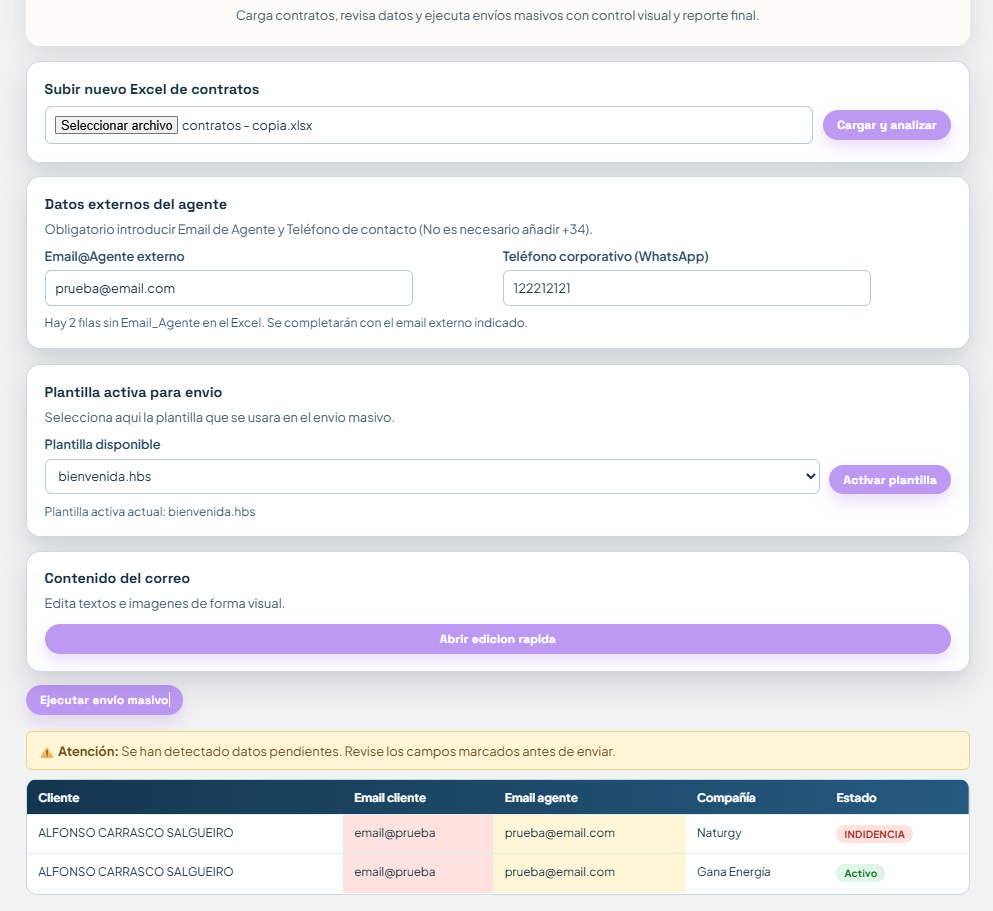
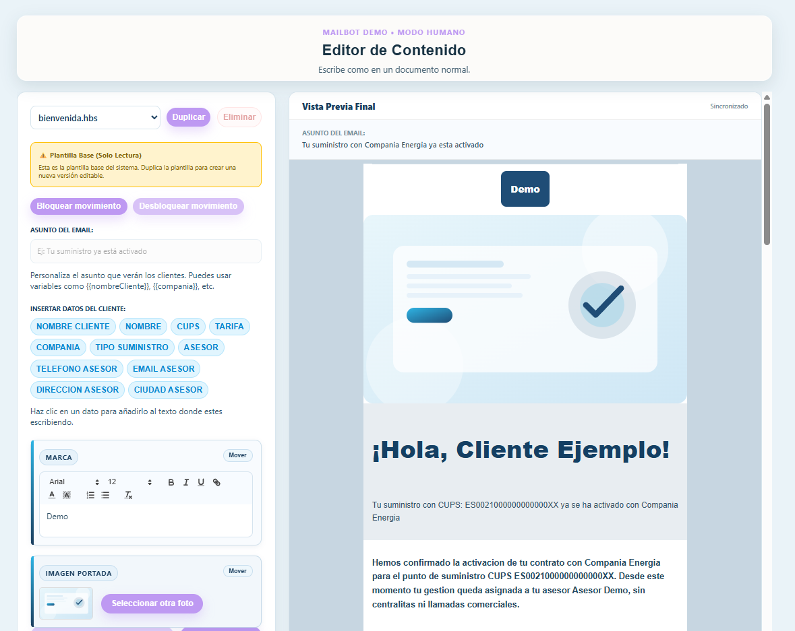
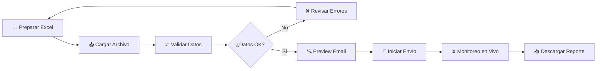

# 📧 Mailbot

> **Plataforma profesional de automatización de marketing por email** • Envío masivo inteligente con personalización dinámica • Validación robusta de datos • Reportes analíticos

[](https://nodejs.org/)
[](https://expressjs.com/)
[](LICENSE)
[](.)

---

## 🎯 Descripción General

**Mailbot** es una aplicación web empresarial que automatiza el proceso completo de campañas de email masivo. Diseñada para profesionales del marketing y ventas, permite gestionar campañas desde la carga de datos hasta la visualización de resultados detallados, todo a través de una interfaz intuitiva y moderna.

### Ideal para:
- 📊 **Agencias de Marketing Digital** - Gestiona campañas de múltiples clientes
- 🏢 **Equipos de Ventas** - Seguimiento personalizado por correo
- 📈 **Especialistas en Growth** - Automatización con análisis de resultados
- 🔧 **Desarrolladores Full-Stack** - Stack moderno y escalable

---

## ✨ Características Principales

### 🎨 **Interfaz Intuitiva y Responsiva**
- Dashboard limpio y profesional
- Carga de archivos drag-and-drop
- Validación visual en tiempo real (código de colores)
- Vistas de estado detalladas por email


*Interfaz completa del MailBot mostrando todos los apartados principales de la plataforma*

### 📤 **Gestión Inteligente de Datos**
- ✅ Importación desde Excel con soporte multi-formato
- ✅ Normalización automática de cabeceras
- ✅ Validación en tiempo real por fila
- ✅ Detección y reportaje de errores específicos
- ✅ Fallback automático de datos faltantes

```json
Campos validados:
- Cliente (obligatorio)
- Email_Cliente (validación regex mejorada)
- CUPS (código cliente)
- Compañía
- Agente (con fallback de config)
```


*Carga de Excel mostrando los datos válidos, datos que faltan, y el apartado de rellenado completado para referencia*

### 📧 **Motor de Envío Masivo Optimizado**
- 🚀 **Rate limiting configurable** - Evita bloqueos de proveedores SMTP
- 🎯 **Concurrencia inteligente** - Máximo 2 envíos simultáneos por defecto
- 🔄 **Fallback automático** - Remitente alterno si el principal es rechazado
- 🧪 **Modo simulación** - Testea campañas sin enviar correos reales
- 🔐 **Autenticación segura** - Integración con contraseñas de aplicación Gmail

### 🎨 **Plantillas HTML Profesionales**
- Diseño responsivo (mobile-first)
- Variables dinámicas: `{{Cliente}}`, `{{Email}}`, `{{CUPS}}`, `{{Compañía}}`, etc.
- Logo personalizable por campaña
- Imágenes embebidas (CID) - funcionan sin conexión a internet
- Botones CTA: WhatsApp + Reseña Google
- Footer con enlaces legales
- Compatibilidad garantizada con todos los clientes de email


*Panel de edición de plantillas para personalizar el contenido de los emails*

### 📊 **Reportes y Análisis**
- 📥 Excel descargable con resultados detallados
- 📝 Desglose por fila: estado, error específico, timestamp
- 📈 Estadísticas: enviados, errores, simulados
- 🔍 Trazabilidad completa de cada email

### 🔒 **Seguridad y Confiabilidad**
- Validación de entrada en backend y frontend
- Manejo robusto de errores
- Logging detallado de operaciones
- Almacenamiento temporal seguro

---

## 🏗️ Arquitectura Técnica

```
┌─────────────────────────────────────────────────────────────┐
│                    Frontend (Navegador)                     │
│              HTML5 + JavaScript Vanilla + CSS3              │
└────────────────────┬────────────────────────────────────────┘
                     │
                     ↓
┌─────────────────────────────────────────────────────────────┐
│                   Backend (Node.js/Express)                 │
│  ┌──────────────┐  ┌──────────────┐  ┌─────────────────┐   │
│  │  API REST    │  │  Validación  │  │  Motor de Envío │   │
│  │  Endpoints   │  │  de Datos    │  │  (Nodemailer)   │   │
│  └──────────────┘  └──────────────┘  └─────────────────┘   │
└────────────────────┬────────────────────────────────────────┘
                     │
        ┌────────────┴────────────┐
        ↓                         ↓
    ┌─────────┐           ┌──────────────┐
    │ Archivos│           │ Servidor SMTP│
    │ Locales │           │ (Gmail/Custom)
    └─────────┘           └──────────────┘
```

### Stack Tecnológico

| Componente | Tecnología | Versión |
|-----------|-----------|---------|
| **Runtime** | Node.js | 18+ LTS |
| **Framework Web** | Express.js | 5.2+ |
| **Procesamiento Excel** | XLSX | 0.18+ |
| **Email** | Nodemailer | 8.0+ |
| **Templating** | Handlebars | 4.7+ |
| **Inlining CSS** | Juice | 11.1+ |
| **Gestión Concurrencia** | p-limit | 7.3+ |
| **Env Variables** | Dotenv | 17.3+ |

---

## 🚀 Inicio Rápido

### Requisitos Previos

- **Node.js** 18+ (recomendado 20 LTS)
- **npm** 9+
- **Cuenta Gmail** con [contraseña de aplicación habilitada](https://myaccount.google.com/apppasswords)
- **Excel** o Google Sheets para datos

### Instalación en 3 pasos

**1. Clonar el repositorio**
```bash
git clone https://github.com/tu-usuario/mailbot.git
cd mailbot
```

**2. Instalar dependencias**
```bash
npm install
```

**3. Configurar variables de entorno**
```bash
cp config.example.json config.json
# Editar config.json con tus credenciales Gmail
```

### Configuración

Edita `config.json` con tus datos:

```json
{
  "email": {
    "usuario": "tu-email@gmail.com",
    "password": "tu-app-password-aqui",
    "smtp_host": "smtp.gmail.com",
    "smtp_port": 465,
    "smtp_secure": true
  },
  "plantilla": {
    "logo_url": "https://tu-dominio.com/logo.png",
    "whatsapp_url": "https://wa.me/34XXXXXXXXX",
    "google_review_url": "https://goo.gl/maps/...",
    "telefono": "+34 XXX XXX XXX"
  },
  "envio": {
    "limite_concurrente": 2,
    "modo_simulacion": false
  }
}
```

### Ejecutar la Aplicación

```bash
# Modo desarrollo
npm run dev

# La app estará disponible en: http://localhost:3000
```

---

## 📚 Guía de Uso

### Flujo Típico de una Campaña



### Paso 1: Preparar Datos

Crea un archivo Excel con las siguientes columnas (el orden no importa):

| Cliente | Email_Cliente | CUPS | Compañía | Agente |
|---------|---------------|------|----------|--------|
| Empresa A | contacto@empresaa.com | 123456ABC | Sector 1 | Juan |
| Empresa B | info@empresab.com | 789012DEF | Sector 2 | María |

### Paso 2: Cargar y Validar

1. Abre la aplicación en tu navegador
2. Haz clic en "Cargar Archivo Excel"
3. Selecciona tu archivo
4. Revisa la validación (códigos de color)

[**[Insertar captura: Paso de validación]**]

### Paso 3: Personalizar (Opcional)

- Ajusta variables de la plantilla
- Activa/desactiva modo simulación
- Configura límite de concurrencia

### Paso 4: Enviar

1. Haz clic en "Iniciar Envío"
2. Monitorea el progreso en tiempo real
3. Visualiza errores al instante

[**[Insertar captura: Envío en progreso]**]

### Paso 5: Analizar Resultados

Descarga el reporte Excel con:
- ✅ Emails enviados exitosamente
- ❌ Errores con descripción específica
- 🧪 Emails simulados (modo test)
- ⏱️ Timestamp de cada operación

---

## 🔌 API Endpoints

### `POST /api/upload`
Carga archivo Excel y valida contenido

**Request:**
```bash
curl -X POST \
  -F "file=@campana.xlsx" \
  http://localhost:3000/api/upload
```

**Response:**
```json
{
  "success": true,
  "total": 150,
  "validos": 148,
  "errores": 2,
  "datos": [
    {
      "fila": 1,
      "cliente": "Empresa A",
      "email": "contacto@empresaa.com",
      "estado": "valido",
      "advertencias": []
    }
  ]
}
```

---

### `POST /api/enviar-campana`
Inicia envío masivo de emails

**Request:**
```json
{
  "datos": [...],
  "modo_simulacion": false,
  "limite_concurrente": 2
}
```

**Response:**
```json
{
  "success": true,
  "campana_id": "1726489234",
  "total": 150,
  "estimado_duracion_segundos": 75
}
```

---

### `GET /api/estado-campana/:id`
Obtiene estado en tiempo real de campaña

**Response:**
```json
{
  "id": "1726489234",
  "estado": "en_progreso",
  "enviados": 45,
  "errores": 2,
  "pendientes": 103,
  "progreso_porcentaje": 30
}
```

---

### `GET /api/descargar-reporte/:id`
Descarga reporte en Excel

---

## 📦 Estructura del Proyecto

```
mailbot/
├── public/                      # Archivos servidos estáticamente
│   ├── index.html              # Interfaz principal
│   ├── script.js               # Lógica frontend
│   ├── styles.css              # Estilos
│   ├── edicion-rapida.html     # Editor de plantillas
│   └── imagenes/               # Recursos gráficos
│
├── src/                        # Código backend
│   ├── server.js               # Punto de entrada
│   └── utils/
│       └── cliente-backend-utils.js  # Utilidades servidor
│
├── templates/                  # Plantillas de email
│   ├── bienvenida.hbs         # Plantilla por defecto
│   ├── email-template.js      # Configuración plantillas
│   └── imagenes-plantilla/    # Assets embebidos
│
├── scripts/                    # Scripts de automatización
│   └── windows/               # Scripts específicos Windows
│
├── config.json                # Configuración local
├── package.json               # Dependencias npm
└── README.md                  # Documentación interna
```

---

## 🛠️ Desarrollo

### Estructura de Endpoints

```javascript
// Ejemplo: Agregar nuevo endpoint
app.post('/api/mi-endpoint', (req, res) => {
  // Validar entrada
  // Procesar
  // Responder
});
```

### Extensiones Comunes

**1. Agregar nuevo proveedor de email**
- Edita `email-template.js`
- Configura credenciales en `config.json`
- Implementa fallback en lógica de envío

**2. Crear nueva plantilla de email**
- Copia `bienvenida.hbs`
- Personaliza con HTML/Handlebars
- Registra en `email-template.js`

**3. Agregar validaciones personalizadas**
- Edita lógica de validación en `cliente-backend-utils.js`
- Propaga cambios a frontend

---

## 🔐 Seguridad

### Best Practices Implementadas

✅ **Validación de entrada** - Sanitización en backend y frontend  
✅ **Manejo de errores** - No expone detalles internos sensibles  
✅ **Credenciales** - Nunca en código, siempre en variables de entorno  
✅ **Rate limiting** - Evita abuso de recursos  
✅ **CORS** - Configurado apropiadamente  

### Recomendaciones para Producción

1. **Usa variable de entorno** `.env` (nunca commitees `config.json`)
2. **Implementa autenticación** - Agrega login con JWT
3. **Usa HTTPS** - Certificado SSL/TLS obligatorio
4. **Monitorea logs** - Implementa logging centralizado
5. **Rate limiting en API** - Previene abuso
6. **Validación exhaustiva** - En frontend y backend

---


## 🐛 Troubleshooting

### "Error: ENOENT - archivo no encontrado"
```
✅ Solución: Verifica que config.json existe y está en el directorio raíz
```

### "Error: Invalid email credentials"
```
✅ Solución: 
  1. Verifica que la contraseña es una "App Password" de Gmail, no tu contraseña normal
  2. Habilita "Acceso de aplicaciones menos seguras"
  3. Comprueba que el email es correcto en config.json
```

### "Error: SMTP port unreachable"
```
✅ Solución:
  1. Verifica conectividad a smtp.gmail.com:465
  2. Revisa que tu firewall no bloquea el puerto 465
  3. Intenta puerto 587 con STARTTLS
```

### "Error: Timeout al cargar Excel"
```
✅ Solución:
  1. Verifica que el archivo Excel es válido
  2. Intenta reducir el número de filas
  3. Comprueba memoria disponible del servidor
```

---

## 📊 Casos de Uso

### 1️⃣ Campaña de Prospección Masiva
```
→ Importa lista de leads
→ Personaliza por empresa
→ Envía 500+ emails
→ Descarga métricas
```

### 2️⃣ Newsletter Segmentada
```
→ Cargar segmentos
→ Diferentes plantillas por grupo
→ Trackear apertura
→ Generar reporte
```

### 3️⃣ Seguimiento de Ventas
```
→ Lista de clientes potenciales
→ Reminder automático
→ Seguimiento por agente
→ Dashboard de resultados
```

---


## 👨‍💻 Autor

**Alfonso Carrasco Salgueiro**

- 💼 [LinkedIn](www.linkedin.com/in/alfonso-carrasco-salgueiro-2b7a95224)
- 🐙 [GitHub](https://github.com/alfonsocarrascosalgueiro)
- 📧 [Email](alfonso.salgueiro.carrasco@gmail.com)

---


## 🎓 Conocimientos Demorados

Este proyecto demuestra:

✅ **Full-Stack Development**
- Node.js, Express.js, APIs REST
- HTML5, JavaScript Vanilla, CSS3
- Integración de APIs externas (Gmail/SMTP)

✅ **Best Practices**
- Estructura de proyecto profesional
- Manejo robusto de errores
- Validación de datos (backend y frontend)
- Documentación clara y completa

✅ **Habilidades DevOps**
- Configuración de variables de entorno
- Scripts de automatización (PowerShell)
- Consideraciones de despliegue

✅ **Atención al Detalle**
- UX/UI responsivo
- Validación visual en tiempo real
- Reportes profesionales
- Manejo de casos edge

---

## 🔜 Roadmap Futuro

- [ ] Interfaz de autenticación (JWT)
- [ ] Panel de análisis avanzado (gráficos)
- [ ] Integración con CRM (Salesforce, HubSpot)
- [ ] Plantillas dinámicas (WYSIWYG editor)
- [ ] A/B Testing
- [ ] Webhooks de delivery
- [ ] API de terceros
- [ ] Temas oscuro/claro

---

**⭐ Si este proyecto te fue útil, considera dejar una estrella en GitHub!**

